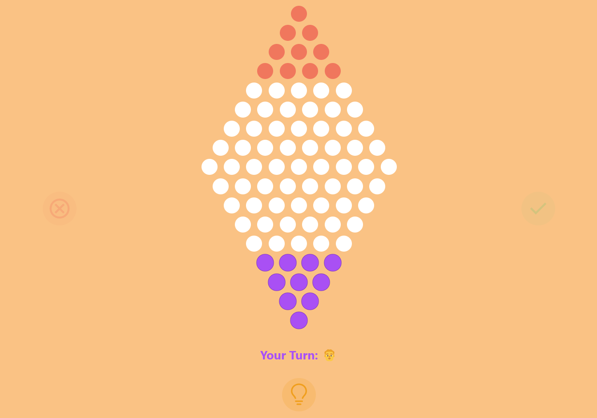

# 🐉 Chinese Checkers Game



## 🤔 What is Chinese Checkers?

**Chinese Checkers** originated in the United States in the 1920s under the name "Hop Ching." The game was inspired by the German game "Stern-Halma," which itself was a variant of the older game **"Halma,"** created in the late 19th century. Although it was marketed as "Chinese Checkers" to attract interest in the U.S., the game has no direct connection to China. The term "Chinese" refers to the use of a star-shaped board, which is visually associated with Eastern design. Over time, the game gained popularity worldwide, becoming a family favorite due to its strategic gameplay and accessibility.

## 🎮 How to Play

In Chinese Checkers, the objective is to move all your pieces from your starting corner to the opposite corner of the star-shaped board. Each player begins with 10 pieces of the same color, placed in one of the six corners. The game accommodates 2 to 6 players, and turns are taken sequentially. On a player's turn, they can either move one piece to an adjacent empty space or jump over a neighboring piece (whether their own or an opponent's) into an empty space directly on the other side. If more jumps are available, the player can continue making consecutive jumps in a single turn, though chain jumps are not mandatory.

The goal is to transport all of your pieces into the triangle opposite your starting corner. The game ends when a player successfully moves all their pieces into the target area. Only one piece can be moved per turn, and while chain jumps are allowed, backward movement into your original corner is not. The game is a blend of strategy and careful planning, requiring players to make the most efficient moves to reach their destination.

### 📚 Rules

- Players can move one piece to an adjacent space or jump over other pieces.
- Players can jump over their own or opponents' pieces.
- Multiple jumps are allowed in a single turn.
- The game ends when a player moves all their pieces to the opposite point.
- The player who moves all their pieces first wins.

## 🤖 AI Features

[Find our AI algorithms here](./src/lib/utils/ai.ts)

| Name       | Description                                     |
| ---------- | ----------------------------------------------- |
| **Easy**   | Uses Minimax with Alpha-Beta Pruning (Depth 2). |
| **Medium** | Uses Minimax with Alpha-Beta Pruning (Depth 4). |
| **Hard**   | Uses Minimax with Alpha-Beta Pruning (Depth 6). |
| **Hint**   | Uses Minimax with Alpha-Beta Pruning (Depth 6). |

## 🚀 Technologies

- [💻 **TypeScript**](https://www.typescriptlang.org/) - Programming language.
- [🛠️ **Svelte**](https://svelte.dev/) - A framework for building web pages.
- [🎨 **Tailwind CSS**](https://tailwindcss.com/) - A framework for styling web pages.
- [🔧 **Node.js**](https://nodejs.org/) - JavaScript runtime for running backend code.
- [⚡ **Bun**](https://bun.sh/) - A fast all-in-one JavaScript runtime for running, bundling, and testing.

## 🛠️ Setup and Installation

1. Clone the repository:
   ```bash
   git clone https://github.com/jumpogpo/ai-chinese-checker.git
   cd ai-chinese-checker
   ```
2. Install the required dependencies:

   ```bash
   npm install
   ```

3. Run the website:
   ```bash
   npm run dev
   ```
4. Open the website:
   - Open your browser and go to [http://localhost:5173/](http://localhost:5173/)

## 📝 License

This project is licensed under the MIT License. See the [LICENSE](LICENSE) file for details.

## 💖 Thanks for owner of this project

<table>
  <tr>
    <td align="center">
      <a href="https://github.com/arthur-x">
        
        <br />
        <sub><b>arthur-x</b></sub>
      </a>
      <br />
      <a title="Owner" href="https://github.com/arthur-x/MarbleFish">👑</a>
    </td>
  </tr>
</table>

## 💕 Contributors

<table>
  <tr>
    <td align="center">
      <a href="https://github.com/jumpogpo">
        
        <br />
        <sub><b>jumpogpo</b></sub>
      </a>
      <br />
      <a title="Algorithm Developer & Game Logic Developer" href="https://github.com/jumpogpo">🤖🎮</a>
    </td>
    <td align="center">
      <a href="https://github.com/BossNz">
        
        <br />
        <sub><b>BossNz</b></sub>
      </a>
      <br />
      <a title="Frontend Developer & Game Logic Developer" href="https://github.com/BossNz">🖼️🎮</a>
    </td>
    <td align="center">
      <a href="https://github.com/MAMMOZ">
        
        <br />
        <sub><b>MAMMOZ</b></sub>
      </a>
      <br />
      <a title="Frontend Developer & Algorithm Developer" href="https://github.com/MAMMOZ">🖼️🤖</a>
    </td>
    <td align="center">
      <a href="https://github.com/Puiluiz">
        
        <br />
        <sub><b>Puiluiz</b></sub>
      </a>
      <br />
      <a title="Frontend Developer" href="https://github.com/Puiluiz">🖼️</a>
    </td>
    <td align="center">
      <a href="https://github.com/chomphoo46">
        
        <br />
        <sub><b>Chomphoo Inchan</b></sub>
      </a>
      <br />
      <a title="Frontend Developer" href="https://github.com/chomphoo46">🖼️</a>
    </td>
    <td align="center">
      <a href="https://github.com/Yanothai11">
        
        <br />
        <sub><b>Yanothai11</b></sub>
      </a>
      <br />
      <a title="Frontend Developer" href="https://github.com/Yanothai11">🖼️</a>
    </td>
    <td align="center">
      <a href="https://github.com/jayubj">
        
        <br />
        <sub><b>jayubj</b></sub>
      </a>
      <br />
      <a title="Tester" href="https://github.com/jayubj">👨‍💻</a>
    </td>
    <td align="center">
      <a href="https://github.com/borball12">
        
        <br />
        <sub><b>borball</b></sub>
      </a>
      <br />
      <a title="Tester" href="https://github.com/borball12">👨‍💻<a>
    </td>
    <td align="center">
      <a href="https://github.com/PunGrumpy">
        
        <br />
        <sub><b>PunGrumpy</b></sub>
      </a>
      <br />
      <a title="Original Author of README" href="https://github.com/PunGrumpy">✍️<a>
    </td>
  </tr>
</table>
